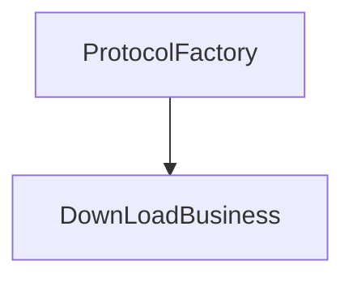

# QuickDownloader
It is C++ application to download file from network by muti-thread.

# 代码基本结构

```mermaid
graph TD;
    ProtocolFactory-->DownLoadBusiness;
```

# 如何去编译
```bash
cd QuickDownloader && make
```


