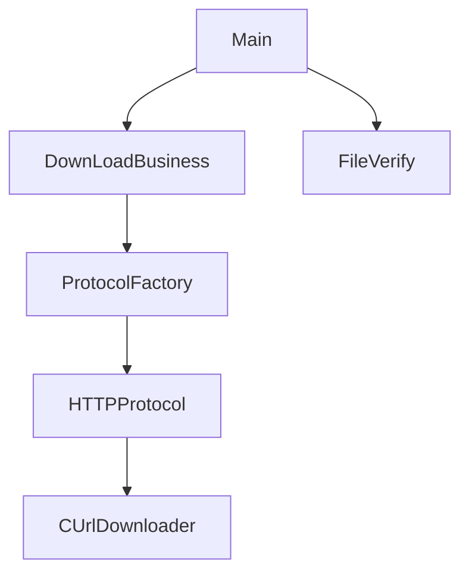

# 基本介绍
这是一个简单的C++ 可执行工具，能够用多线程的方式去下载一个文件。

# 代码基本结构


# 安装依赖

```bash
sudo apt-get update
sudo apt-get install libcurl4-openssl-dev
sudo apt-get install libssl-dev
```

# 如何去编译
```bash
cd build && ./build.sh
```

# 测试结果

Mac 测试结果
```
Mac 环境: MacBook Pro Intel 13.5 
测试命令: ./bin/QuickDownloader http://pt.qa.webex.com:8080/19_12_PT/pt_build/41.12.0/master/webex-client-packaging-41.12.0.120-webexapp.dmg 1.dmg  404262543c9ae1c3cecf0ec57f7465c7
结果: 
file size is 182.747MB
start to download file 1.dmg [0,23952960]
start to download file 1.dmg [23952961,47905921]
start to download file 1.dmg [47905922,71858882]
start to download file 1.dmg [71858883,95811843]
start to download file 1.dmg [95811844,119764804]
start to download file 1.dmg [119764805,143717765]
start to download file 1.dmg [143717766,167670726]
start to download file 1.dmg [167670727,191623691]
download file 1.dmg [143717766,167670726] result = success
download file 1.dmg [167670727,191623691] result = success
download file 1.dmg [23952961,47905921] result = success
download file 1.dmg [0,23952960] result = success
download file 1.dmg [71858883,95811843] result = success
download file 1.dmg [47905922,71858882] result = success
download file 1.dmg [95811844,119764804] result = success
download file 1.dmg [119764805,143717765] result = success
Download success, it took 18.7459 seconds
file verify success, md5=404262543c9ae1c3cecf0ec57f7465c7
```

Linux 测试结果
```
Linux 环境：Ubuntu 20.04.4 LTS

```


# 未来优化的方向
1. 将账号和密码写入header, 支持下载需要账号密码的链接
2. 根据账号和密码生成token，支持下载需要token的链接
3. 实现FTP协议
4. 实现文件进度提醒以及最大线程数的配置


